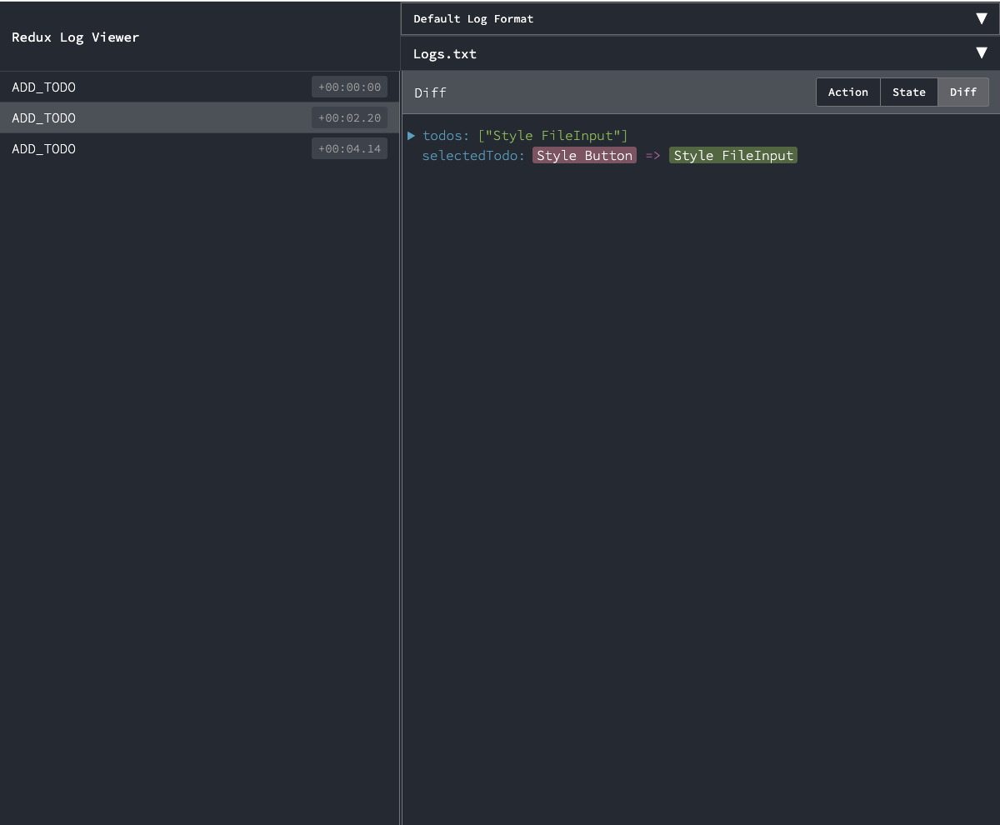

# redux-log-viewer



## Getting Started
To setup **redux-log-viewer**, the following should be installed on your machine.

- [Node.js](https://nodejs.org/en/download/current/) 12 and above
- [Git](https://git-scm.com/downloads)

### Installation

If you have all the prerequisites you can use the steps below to setup **redux-log-viewer** locally.

##### Clone redux-log-viewer
- Open your terminal and `cd` to the directory where you will like to download **redux-log-viewer**, then run
```sh
git clone https://github.com/TurtleAI/redux-log-viewer.git
```
- Change to the **redux-log-viewer** directory
```sh
cd redux-log-viewer
```


##### Install Dependencies
- Run the command below to install `node` dependencies
```bash
npm install yarn -g
yarn install
```

### Usage
- To start **redux-log-viewer** run
```sh
yarn start
```

## Built With
- [react](https://reactjs.org/)
- [styled-components](https://styled-components.com/)
- [react-json-tree](https://github.com/reduxjs/redux-devtools/tree/master/packages/react-json-tree)
- [jsondiffpatch](https://github.com/benjamine/jsondiffpatch)

## Author

* **Chima Chukwuemeka** [@chukwuemekachm](https://github.com/chukwuemekachm)
