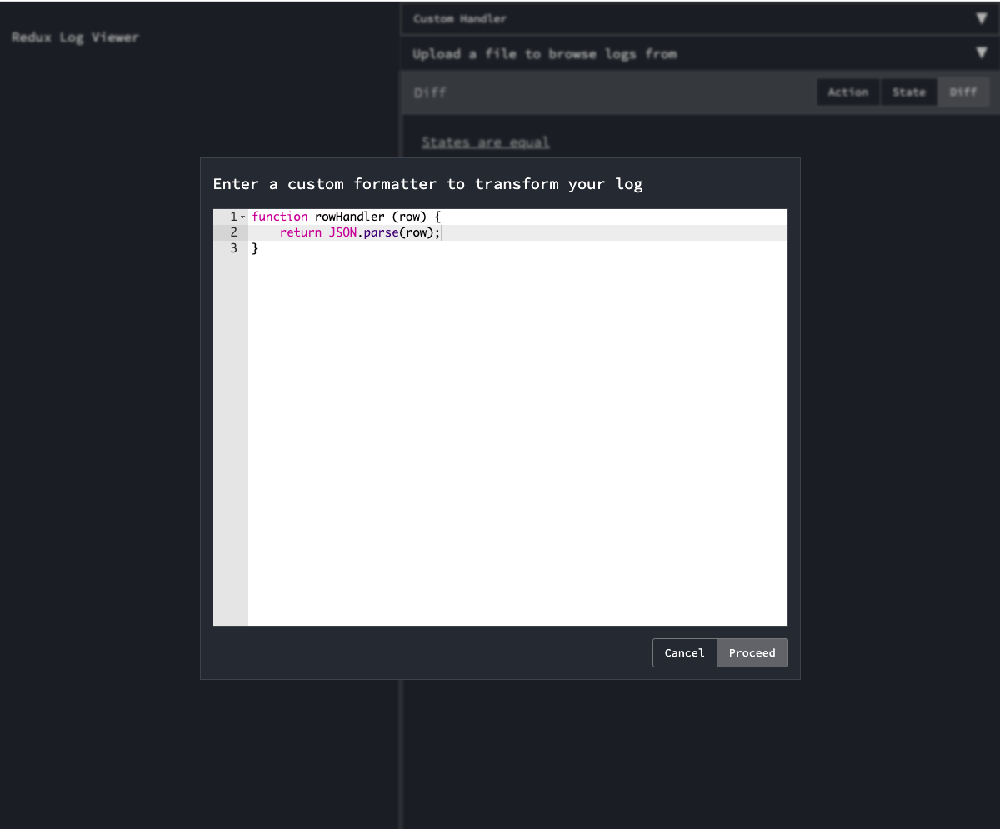

# redux-log-viewer




## Getting Started
To setup **redux-log-viewer**, the following should be installed on your machine.

- [Node.js](https://nodejs.org/en/download/current/) 12 and above
- [Git](https://git-scm.com/downloads)

### Installation

If you have all the prerequisites you can use the steps below to setup **redux-log-viewer** locally.

##### Clone redux-log-viewer
- Open your terminal and `cd` to the directory where you will like to download **redux-log-viewer**, then run
```sh
git clone https://github.com/TurtleAI/redux-log-viewer.git
```
- Change to the **redux-log-viewer** directory
```sh
cd redux-log-viewer
```


##### Install Dependencies
- Run the command below to install `node` dependencies
```bash
npm install yarn -g
yarn install
```

### Usage
- To start **redux-log-viewer** run
```sh
yarn start
```
This would start **redux-log-viewer** locally and launch your default web browser in the process. If your default browser is not opened, open your browser and navigate to `http://localhost:3000`.

### Log File Formats
Currently there are two log file formats ( **default** and **action StringMap** formats ) supported on **redux-log-viewer** as well as an option to provide a logs row/line transformer which will be used to transform the row (log) to the **default** log format.

#### Default Log Format
This is the default supported log format of **redux-log-viewer** under the hood, every other format under the hood transforms to this format.
In this format, every log/row is expected to be a `stringified` JSON object. This is because most file input/output streams only support writing and reading strings through the IO streams.

Below is a description of the object format.

```js
{
  "action": {
    "type": "ADD_TODO",
    "payload": "Style Button" // anything, could be a string, a number, an array or an object as well
  }, // object
  "state": {
    "property": "value"
  }, // anything, could be a string, a number, an array or an object as well
  "time": "2019-10-05T14:48:00.000Z" // ISO 8601 timestamp
}
```
As explained above, the default expects a `stringified` JSON of the object above on each log line.

#### Action StringMap Log Format
This is the second supported log format of **redux-log-viewer**. This resolves the log to the **default** log format as well.
Just like the **default** log format, this also expects every log/row is expected to be a `stringified` JSON object.

Below are two descriptions of the object format.

```js
{
  "action": "Action.connectRequested" // string
  "state": "KeepAliveState(targetConnectionState: WSConnection…LifecycleState.resumed, isHeartbeatActive: false)" // a string representation of a map
}
```

```js
{
  "action": "ConnectionStateChanged(state: WSConnectionState.connecting)" // a string representation of a map
  "state": "KeepAliveState(targetConnectionState: WSConnection…LifecycleState.resumed, isHeartbeatActive: false)" // a string representation of a map
}
```

#### Custom log row handler/transformer
Unlike the two formats above, the custom handler option prompts the user to provide a custom function to be used to transform the logs.
The custom handler function should be a function that accepts a single argument (a line of the log) and returns an object which is similar to the default object used under the hood by **redux-log-viewer**. This handler will be applied to every log line in an input file.

> The function is expected to return a JavaScript object and not a `stringified` JSON object.

Below is the simplest log line transformer.

```js
function (logRow) {
  return JSON.parse(logRow);
}
```


## Built With
- [react](https://reactjs.org/)
- [styled-components](https://styled-components.com/)
- [react-json-tree](https://github.com/reduxjs/redux-devtools/tree/master/packages/react-json-tree)
- [jsondiffpatch](https://github.com/benjamine/jsondiffpatch)

## Author

* **Chima Chukwuemeka** [@chukwuemekachm](https://github.com/chukwuemekachm)
